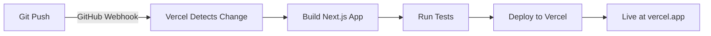

# GitHub Repository Analyzer - Deployment Guide

## Quick Start to Deployment

Follow these steps to deploy the GitHub Repository Analyzer to Vercel.

### Prerequisites
- GitHub account with admin access to a repository
- Vercel account (free or paid)
- Node.js 18+

---

## Step 1: Prepare Your GitHub Repository

### Create a new GitHub repository

```bash
cd github-analyzer
git init
git add .
git commit -m "feat: Initial commit - GitHub Repository Analyzer"
git branch -M main
git remote add origin https://github.com/YOUR_USERNAME/github-analyzer.git
git push -u origin main
```

### Create GitHub Personal Access Token

1. Go to: https://github.com/settings/tokens
2. Click "Generate new token (classic)"
3. Set scopes:
   - `public_repo` (required)
   - `read:user` (optional)
4. Copy the token (you'll need it for Vercel)

---

## Step 2: Deploy to Vercel

### Option A: Via Vercel Dashboard (Recommended)

1. **Sign in to Vercel**
   - Go to https://vercel.com
   - Sign in with GitHub

2. **Create New Project**
   - Click "New Project"
   - Select your `github-analyzer` repository
   - Click "Import"

3. **Configure Environment Variables**
   - Find "Environment Variables" section
   - Add:
     ```
     Name: GITHUB_TOKEN
     Value: ghp_xxxxxxxxxxxxxxxxxxxxxxxxxxxx
     ```
   - Select Environment: "Production" (optionally add to Preview/Development)

4. **Deploy**
   - Click "Deploy"
   - Wait for build to complete (~2-3 minutes)
   - You'll get a URL like: `https://github-analyzer-xxxxx.vercel.app`

### Option B: Via Vercel CLI

```bash
# Install Vercel CLI
npm i -g vercel

# Login to Vercel
vercel login

# Deploy
vercel --prod

# Enter environment variables when prompted
# GITHUB_TOKEN: ghp_xxxxxxxxxxxxxxxxxxxxxxxxxxxx
```

---

## Step 3: Verify Deployment

1. **Visit your Vercel URL**
   - Open `https://github-analyzer-yourname.vercel.app`

2. **Test the analyzer**
   - Enter a repository: `facebook/react`
   - Click "Analyze Repositories"
   - Should see analysis results in ~3-5 seconds

3. **Check logs** (if needed)
   - Go to Vercel dashboard
   - Select your project
   - Go to "Deployments"
   - Click latest deployment
   - Check "Functions" tab for API logs

---

## Step 4: Custom Domain (Optional)

1. Go to Project Settings in Vercel
2. Select "Domains"
3. Add your custom domain
4. Follow DNS configuration instructions

---

## Troubleshooting

### ❌ Error: "API call failed"

**Solution**: Check GitHub token
```bash
# Verify token is valid
curl -H "Authorization: token YOUR_TOKEN" https://api.github.com/user
```

### ❌ Error: "Maximum build time exceeded"

**Solution**: This shouldn't happen with next.js, but if it does:
- Check for large dependencies in package.json
- Remove unused dependencies
- Rebuild locally: `npm run build`

### ❌ Error: "Repository not found"

**Solution**: Ensure:
- Repository spelling is correct (case-sensitive)
- Repository is public
- GitHub token has `public_repo` scope

### ⚠️ Slow performance

**Solution**: Implement rate-limit handling
- Check remaining API calls
- Consider using authenticated requests
- Add caching layer (Redis would help)

---

## Environment Variables Reference

| Variable | Required | Description |
|----------|----------|-------------|
| `GITHUB_TOKEN` | ⚠️ Optional* | GitHub API token for better rate limits |

*Optional but highly recommended. Without it, you get 60 requests/hour instead of 5000.

---

## Scaling & Optimization

### For High Traffic:
1. Add Redis cache (Vercel KV)
2. Implement result caching
3. Add distributed rate limiting

### For Large-Scale Analysis:
1. Use GitHub GraphQL API
2. Implement batch processing
3. Add database for historical data

---

## Monitoring

### Vercel Provides:
- Build logs
- Runtime logs
- Performance metrics
- Error tracking

### Access Monitoring:
1. Go to Vercel Dashboard
2. Select your project
3. Check "Deployments" or "Analytics" tab

---

## Setting Up Custom Analytics

Add to `_document.js` if needed:
```javascript
<script async src="https://cdn.workos.com/analytics.js"></script>
```

---

## CI/CD Pipeline Setup

### Automatic Deployment on Push

Vercel automatically deploys when you push to main:



### Preview Deployments

Create a pull request on GitHub → Vercel automatically creates a preview deployment
- Preview URL: `https://github-analyzer-pr-123.vercel.app`

---

## Performance Metrics

Target performance:
- **First Contentful Paint**: < 1.5s
- **Largest Contentful Paint**: < 2.5s
- **Cumulative Layout Shift**: < 0.1
- **API Response Time**: < 3s (depends on GitHub API)

Check Performance:
1. Vercel Dashboard → Analytics
2. Lighthouse: https://pagespeed.web.dev

---

## Rollback Instructions

If something goes wrong:

1. Go to Vercel Dashboard
2. Click "Deployments"
3. Find the previous working version
4. Click the "..." menu
5. Select "Promote to Production"

Or via CLI:
```bash
vercel rollback
```

---

## Additional Resources

- **Vercel Docs**: https://vercel.com/docs
- **Next.js Docs**: https://nextjs.org/docs
- **GitHub API Docs**: https://docs.github.com/en/rest

---

## Support & Questions

- Check Vercel Status: https://www.vercelstatus.com
- GitHub Discussions: Open issue on your repository
- Vercel Support: https://vercel.com/support

---

## What's Next?

After successful deployment:

1. **Add Authentication**: Implement user logins for saved analyses
2. **Database Integration**: Store analysis history
3. **Export Features**: PDF/CSV reports
4. **Webhooks**: Real-time repository tracking
5. **AI Insights**: Use Claude API for intelligent recommendations

---

**Congratulations! Your GitHub Repository Analyzer is live! 🚀**
